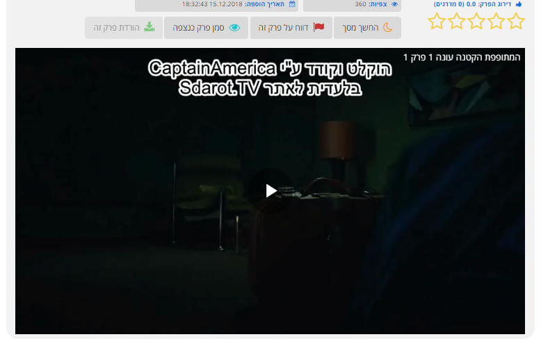

# SdarotDownload
Enable Sdarot video download

This script is Chrome Extension that enable the controllers of a Video feed. 
When video controllers enable it will show a Download button for the video.

1. Download the zip file from this site.
2. Extract the file as it is - Folder : **Sdarot**
2. Go to chrome://extensions/
3. Enable Developement Mode - מצב פיתוח in the top corner.
4. Drag and drop The Folder **Sdarot** and all its content to the Chrome Tab chrome://extensions/
5. Go To https://sdarot.world and open the video you want to download.

6. Click the Extension button near the Address bar on the Chrome browser.
7. Click **Show** 
8. The video panel will show the controllers on hover.
9. Click to Download.
